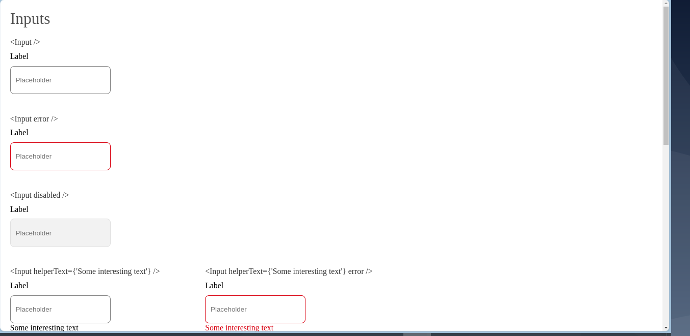

<!-- Please update value in the {}  -->

<h1 align="center">Input Component</h1>

<!-- TABLE OF CONTENTS -->

## Table of Contents

- [Overview](#overview)
- [Built With](#built-with)
- [How to use](#how-to-use)
- [Contact](#contact)

<!-- OVERVIEW -->

## Overview



Esse projeto foi proposto pela devChallenges, o desafio consiste em criar um componente de input, com diferentes estilos atendendo a todos os requisitos passados pelo projeto do figma.

### Built With

- [React](https://reactjs.org/)
- CSS

## How To Use

<!-- This is an example, please update according to your application -->

Primeiro clone o repositorio em sua maquina, apos isso va até o diretorio do seu projeto pelo terminal e execute o comando npm install para baixar as dependencias do projeto, apos isso execute npm start para executar o projeto.

```bash
# Clone this repository
$ git clone https://github.com/joaoalberis/devchallenges.git

$ cd ./devchallenges/ChallengesFrontEnd/inputcomponent

# Install dependencies
$ npm install

# Run the app
$ npm start
```

## Contact

- Site [Input Component](https://inputcomponent-two.vercel.app/)
- GitHub [@joaoalberis](https://{github.com/joaoalberis})
