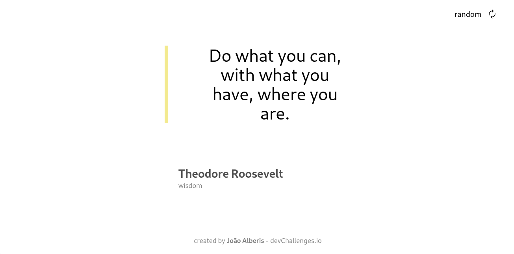
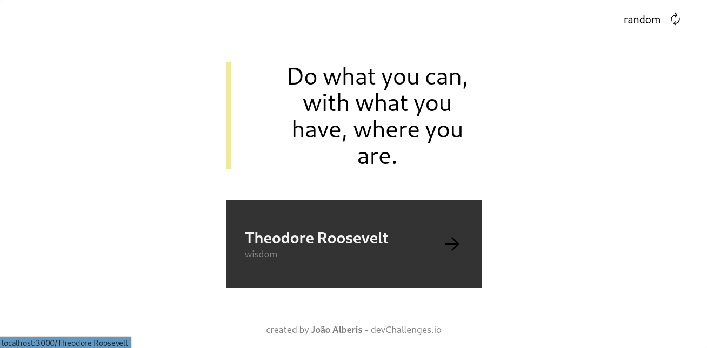
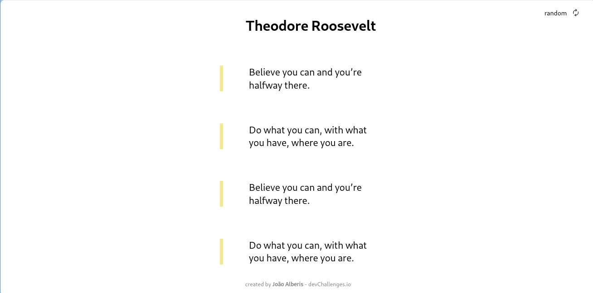

<!-- Please update value in the {}  -->

<h1 align="center">Generator Quote</h1>

<!-- TABLE OF CONTENTS -->

## Table of Contents

- [Overview](#overview)
- [Built With](#built-with)
- [How to use](#how-to-use)
- [Contact](#contact)

<!-- OVERVIEW -->

## Overview


"


Esse projeto foi proposto pela devChallenges, o desafio consiste em criar uma pagina de geração de quotes, onde o usuario pode gerar um novo quote ou entao abrir informações adicionais sobre o autor, local que é possivel visualizar todas as quotes desse autor.

### Built With

- [React](https://reactjs.org/)
- [React Router](https://reactrouter.com/en/main)
- [TailwindCSS](https://tailwindcss.com/)

## How To Use

<!-- This is an example, please update according to your application -->

Primeiro clone o repositorio em sua maquina, apos isso va até o diretorio do seu projeto pelo terminal e execute o comando npm install para baixar as dependencias do projeto, apos isso execute npm start para executar o projeto.

```bash
# Clone this repository
$ git clone https://github.com/joaoalberis/devchallenges.git

$ cd ./devchallenges/ChallengesFrontEnd/quotegenerator

# Install dependencies
$ npm install

# Run the app
$ npm start
```

## Contact

- Site [Quote Generator](https://quotegenerator-airo.onrender.com)
- GitHub [@joaoalberis](https://github.com/joaoalberis)
